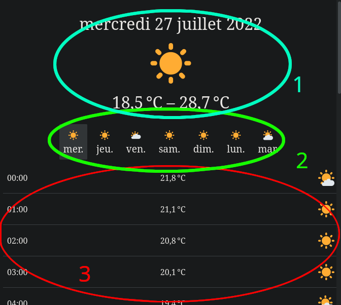

# Meteoji
Bienvenue à toi, jeune candidat dev frontend !
Tu vas avoir la chance de participer à un projet qui pourrait bien révolutionner (ou pas) la diffusion de prévisions météo sur Internet.


### Prérequis

* Un navigateur qui affiche les emojis (en 2022, ça devrait le faire...)
* nodeJs 18+
* yarn
* git
* clavier
* souris (optionnel)
* cerveau

## Présentation
Le but de ce test est de recréer [cette page web](https://meteoji.n00dl3.ovh/) à partir du code de ce dépot. Code que les forces du mal (moi) ont ~~accidentellement~~ cassé.

Cette petite application récupère les informations de la météo lyonnaise via l'API openmeteo, transforme les informations et affiche les prévisions
de la semaine avec de très jolis émojis.

## Lancement du serveur de développement
On commence par installer les dépendances et lancer le projet :
```
  yarn install
  yarn start
```

## Ce qu'il faut réparer

### Le traitement des données d'API : 

la fonction `dailyMeteoComputer` (fichier `src/meteo/compute-daily-meteo.ts`) doit tranformer les données de l'api passées en paramètre et renvoie des prévisions météos regroupées par jour.
Un vilain Gobelin a effacé la logique de cette fonction, et elle ne renvoie plus qu'un tableau vide.

#### Les données en entrée
Le seul paramètre de la fonction représente les données renvoyées par l'API qui renvoie les prévisions par heure sur 7 jours (**à partir de la date d'aujourd'hui à minuit**) dans ce format :
```json
{
  "hourly":{
    "time":["2022-07-27T00:00",...],
    "temperature_2m": [30,...],
    "weathercode": [0,...]
  }
}
```

Pour une réponse d'api `response`, chaque propriété de `response.hourly` est un tableau contenant 7x24=168 entrées, représentant respectivement:

* `time` : La date et l'heure de la prévision **(toujours en timezone FR métropole)**.
* `temperature_2m` La température à cette date/heure
* `weathercode` Un nombre encodant le temps qu'il fait à cette heure.
 
#### La sortie attendue
Il va falloir **grouper ces prévisions par jour**. Nous attendons un tableau contenant 7 entrées (une pour chaque jour de la semaine de prévision),
chaque entrée étant un objet avec les propriétés suivantes:
* `date`: un objet `Date` renseignant la date du jour;
* `weatherCode`: un nombre représentant le temps qu'il fait globalement dans la journée, c'est à dire le code qui apparait le plus dans les prévisions horaires;
* `maxTemperature`: (nombre) la température maximale de la journée;
* `minTemperature`: (nombre) la température minimale de la journée;
* `hourly`: un tableau contenant 24 entrées (une par heure) chauqe entrée étant un objet avec les propriétés suivantes:
  * `time` Un objet `Date` représentant la date et l'heure de cette prévision
  * `weatherCode`:  Code de temps (entier naturel) représentatn le temps qu'il fait à cette heure-ci
  * `temperature` un nombre donnant la Température à cette heure.

### Le composant principal
Le composant situé dans `src/meteo/meteo.tsx` doit être réparé.
Il récupère les prévisions (issues de la fonction que tu as réparé précédemment) via la prop `week`.
Il faudra :
* Afficher un aperçu de la prévision pour chaque jour de la semaine (2)
* pouvoir sélectionner un jour en cliquant sur un élément de la liste (2) (par défaut le premier jour de la semaine de prévision est sélectionné)
* afficher la prévision globale du jour sélectionné (1)
* afficher les prévisions heure par heure du jour sélectionné (3)



## Typescript
On utilise Typescript pour tous nos projets mais si on ne connait pas, ça peut être perturbant. Si jamais tu es trop perdu, tu peux faire ce test sans typescript:
renomme les deux fichiers sur lesquels tu dois intervenir en `meteo.jsx` et `compute-daily-meteo.js`.

C'est évidemment mieux de faire avec...

## Infos utiles

* La météo n'envoie que des température en degrés celsius, pas besoin de chercher à variabiliser ça.
* Les dates et heures de l'API sont envoyées sur la Timezone française (CEST), on considère que c'est celle du navigateur,
  il ne faut pas chercher à ajuster l'heure en fonction de celle de l'utilisateur.
* Ne cherche pas trop loin, à priori il n'y a rien à toucher ailleurs que dans le composant `Meteo` et la fonction `dailyMeteoComputer`.